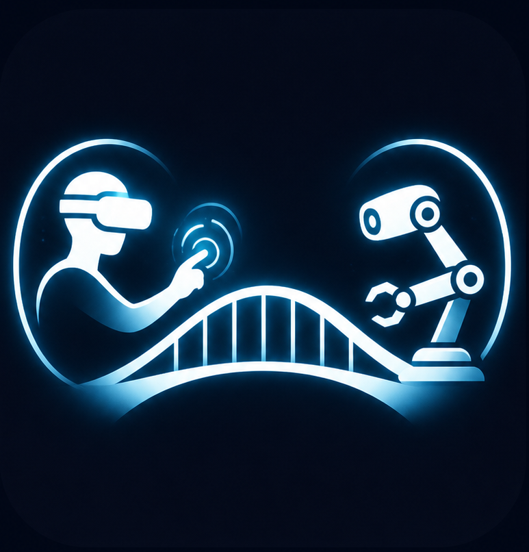

<p align="center">
  
</p>

<h1 align="center">PICO Bridge</h1>

<p align="center">
  Stream PICO headset, controller, hand, body, and Motion Tracker data to a PC.
  <br/>
  Optionally stream PC camera video back to the headset.
</p>

<p align="center">
  <a href="docs/en/README.md">English Docs</a> •
  <a href="docs/zh/README.md">中文文档</a> •
  <a href="docs/en/pc-receiver.md">PC Receiver</a> •
  <a href="docs/en/unity-development.md">Unity Development</a>
</p>

---

## Highlights

- **PICO tracking bridge**: headset, controllers, hands, body, and Motion Tracker data.
- **PC-side Python SDK**: import `PicoBridge` directly from other Python projects.
- **Optional video return**: stream PC camera / RealSense / test-pattern video back to the headset.
- **Built-in 3D Unity mainline**: no URP or Live Preview dependency.
- **Dependency-friendly PC package**: downstream projects can depend only on `pc_receiver`.

---

## Quick Start

**1. Prepare the headset**

1. Connect the PICO headset and PC to the same local network.
2. Disable the safety boundary in the PICO developer menu before use.
3. Enable `Settings > Interaction > Automatic switching between gestures and controllers` on the headset.
4. Install the APK, or build and install it with Unity `2022.3.62f3`.
5. Start the PICO Bridge app in the headset.

**2. Start the PC receiver**

```bash
cd pc_receiver
pip install -e .
pico-bridge-receiver -v --video camera --viz
```

**3. Connect**

Connect to the PC receiver from the PicoBridge panel in the headset.

Manual APK installation:

```bash
sudo apt update
sudo apt install android-tools-adb
adb devices
adb install -r path/to/pico-bridge.apk
```

Full-body motion capture requires Motion Tracker setup and calibration in the PICO system before use.

---

## Documentation

| Topic | English | 中文 |
| --- | --- | --- |
| Documentation Home | [docs/en/README.md](docs/en/README.md) | [docs/zh/README.md](docs/zh/README.md) |
| PC Receiver API | [pc-receiver.md](docs/en/pc-receiver.md) | [PC 接口](docs/zh/pc-receiver.md) |
| Unity Development | [unity-development.md](docs/en/unity-development.md) | [Unity 结构和开发](docs/zh/unity-development.md) |
