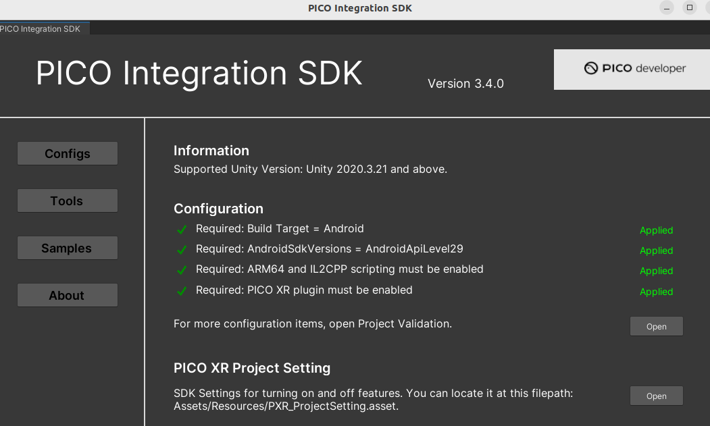

# pico-bridge

这是一个基于 Unity 的 PICO / VR 项目，PICO Unity SDK 与 PICO Live Preview 插件都以 Unity embedded package 的方式放在 `Packages/` 目录下进行管理，并作为仓库内容直接跟踪。

## 环境要求

- Unity：`2022.3.62f3`
- 渲染管线：Universal Render Pipeline（URP）
- 目标平台：Android / PICO 头显
- PICO Unity 官方文档：<https://developer.picoxr.com/zh/document/unity/>

## 目录结构

- `Assets/`：项目场景、运行时代码、编辑器代码和 Unity 资源
- `Packages/manifest.json`：Unity Package Manager 依赖配置
- `Packages/PICO-Unity-Integration-SDK/`：仓库内置的 PICO SDK，对应包 `com.unity.xr.picoxr`
- `Packages/Unity-Live-Preview-Plugin/`：本地 PICO Live Preview 包，对应包 `com.unity.pico.livepreview`
- `ProjectSettings/`：Unity 项目设置
- `AGENTS.md`：项目内开发代理约定

## 项目初始化

首次拉取仓库后，直接进入项目目录即可：

```bash
git clone <repo-url>
cd pico-bridge
```

然后使用 Unity `2022.3.62f3` 打开项目。

## Unity 包管理说明

当前项目中的 PICO 相关包直接放在 `Packages/` 下，Unity 会把它们识别为 embedded package：

- `Packages/PICO-Unity-Integration-SDK/package.json`
- `Packages/Unity-Live-Preview-Plugin/package.json`

进入unity之后勾选默认配置


打开 Unity 后建议检查：

1. 打开 `Window > Package Manager`
2. 确认 `PICO Integration` 已显示
3. 确认 `PICO Live Preview` 已显示
4. 等待 Unity 完成依赖解析，并在需要时更新 `Packages/packages-lock.json`

不要把这些包复制到 `Assets/` 中。

## PICO / XR 配置步骤

在 Unity 中按以下顺序配置：

1. 打开 `File > Build Settings`
2. 选择 `Android` 并切换平台
3. 打开 `Edit > Project Settings > XR Plug-in Management`
4. 在 Android 平台下启用 PICO Provider
5. 打开 XR / PICO 的 Project Validation 面板并修复提示项
6. 在 Player Settings 中设置真实可用的 Android 包名

涉及 PICO SDK 接口、平台行为、接入方式时，优先查阅官方文档：

<https://developer.picoxr.com/zh/document/unity/>

## Live Preview 开发说明

Live Preview 插件位于：

- `Packages/Unity-Live-Preview-Plugin/`

常用入口文件：

- `Packages/Unity-Live-Preview-Plugin/Runtime/Scripts/PXR_PTLoader.cs`
- `Packages/Unity-Live-Preview-Plugin/Runtime/Scripts/PXR_PTSettings.cs`
- `Packages/Unity-Live-Preview-Plugin/Runtime/UnitySubsystemsManifest.json`

主要运行时命名空间：

```csharp
Unity.XR.PICO.LivePreview
```

如果要查找 Live Preview 的加载器、配置项、子系统入口或输入相关实现，优先从上述文件开始。

## 开发约定

1. 运行时代码放在 `Assets/` 下
2. 编辑器专用代码放在 `Editor/` 目录下
3. 新增、移动、删除 Unity 资源时要保留 `.meta` 文件
4. 包依赖优先通过 `Packages/manifest.json` 管理
5. Unity 解析包之后，保持 `Packages/packages-lock.json` 同步
6. 不要提交 Unity 自动生成目录，如 `Library/`、`Temp/`、`Obj/`、`Logs/`、`Build/`、`Builds/`、`UserSettings/`

## 提交前验证

在提交代码或包配置前，建议至少完成以下检查：

1. 使用 Unity `2022.3.62f3` 打开项目
2. 确认 Unity Package Manager 没有解析错误
3. 检查 Console 中没有脚本编译错误
4. 如果修改了 XR / PICO 配置，重新跑一遍 Project Validation
5. 如果涉及设备能力，尽量在 PICO 真机上测试

## 常用命令

查看本地包元数据：

```bash
cat Packages/PICO-Unity-Integration-SDK/package.json
cat Packages/Unity-Live-Preview-Plugin/package.json
```
